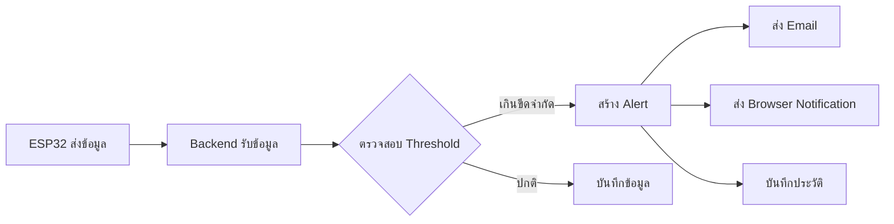

# 🔔 ระบบแจ้งเตือนเซ็นเซอร์ - Quick Start Guide

## สิ่งที่ได้เพิ่มเข้ามา

ระบบแจ้งเตือนอัตโนมัติที่ตรวจสอบค่าเซ็นเซอร์และแจ้งเตือนเมื่อค่าเกินขีดจำกัดที่กำหนด

### ✨ ฟีเจอร์หลัก

- ✅ ตั้งค่าขีดจำกัด (Min/Max) สำหรับเซ็นเซอร์ 5 ประเภท
- ✅ แจ้งเตือนผ่าน Email + Browser Notification  
- ✅ 4 ระดับความรุนแรง: Info, Warning, Error, Critical
- ✅ ประวัติการแจ้งเตือนแบบ Real-time
- ✅ เปิด/ปิดการแจ้งเตือนได้ทีละรายการ

---

## 🚀 เริ่มใช้งาน (3 ขั้นตอน)

### ขั้นที่ 1: สร้างตาราง DynamoDB

```powershell
.\setup-threshold-tables.ps1
```

### ขั้นที่ 2: เริ่ม Backend + Frontend

```powershell
# Terminal 1 - Backend
cd backend
npm start

# Terminal 2 - Frontend  
cd frontend
npm run dev
```

### ขั้นที่ 3: เข้าสู่ระบบและตั้งค่า

1. เปิด http://localhost:3000
2. Login เข้าระบบ
3. ไปที่ **Dashboard > Alerts** (เมนูด้านซ้าย)
4. ตั้งค่าขีดจำกัดสำหรับเซ็นเซอร์

---

## 📱 การใช้งาน

### ตั้งค่าขีดจำกัด (Threshold)

1. **เลือก Device ID** (เช่น ESP32_001)
2. **เพิ่มค่าขีดจำกัด**:
   - เลือกประเภทเซ็นเซอร์
   - กำหนดค่า Min/Max
   - เลือกช่องทางแจ้งเตือน (Email/Browser)
3. กด **"เพิ่มค่าขีดจำกัด"**

### ดูการแจ้งเตือน

- แท็บ **"การแจ้งเตือน"** แสดงรายการแจ้งเตือนทั้งหมด
- สีแสดงความรุนแรง: 🔴 Critical | 🟠 Error | 🟡 Warning | 🔵 Info
- ✅ ทำเครื่องหมายอ่านแล้ว | 🗑️ ลบการแจ้งเตือน

### เปิด Browser Notification

1. คลิก **"เปิดการแจ้งเตือน"**
2. อนุญาตใน Browser
3. รับการแจ้งเตือนแบบ Real-time!

---

## 🎯 ตัวอย่างค่าแนะนำ

| เซ็นเซอร์ | Min | Max | หน่วย |
|-----------|-----|-----|-------|
| อุณหภูมิ | 15 | 35 | °C |
| ความชื้น | 30 | 80 | % |
| PM2.5 | - | 50 | µg/m³ |
| แสง | 100 | 1000 | Lux |

---

## 📡 API Endpoints

```http
# Threshold Management
POST   /api/thresholds                    # สร้าง
GET    /api/thresholds/device/:deviceId   # ดึงของ device
PUT    /api/thresholds/:id                # อัปเดต
DELETE /api/thresholds/:id                # ลบ

# Notifications
GET    /api/alerts/device/:deviceId       # ดึงของ device
GET    /api/alerts/unread                 # ดึงที่ยังไม่อ่าน
PUT    /api/alerts/:id/read               # ทำเครื่องหมายอ่านแล้ว
DELETE /api/alerts/:id                    # ลบ
```

---

## 🔄 การทำงานของระบบ



---

## 🐛 แก้ไขปัญหา

### ไม่ได้รับการแจ้งเตือน
- ✅ ตรวจสอบ Threshold ถูกเปิดใช้งาน (enabled: true)
- ✅ ตรวจสอบค่าเซ็นเซอร์เกินขีดจำกัดจริง
- ✅ อนุญาต Browser Notification

### Email ไม่ส่ง  
- ✅ ตั้งค่า `ADMIN_EMAIL` ใน `.env`
- ✅ ตรวจสอบ Email Service

### ตารางไม่สร้าง
- ✅ ตรวจสอบ AWS Credentials
- ✅ รันสคริปต์อีกครั้ง

---

## 📚 ไฟล์ที่เกี่ยวข้อง

```
📦 Backend
├── services/threshold.service.ts       # Logic หลัก
├── services/sensor.service.ts          # ตรวจสอบค่าอัตโนมัติ
└── scripts/setup-threshold-tables.ts   # สร้างตาราง

📦 Frontend  
├── app/dashboard/alerts/page.tsx       # หน้าจัดการ
├── components/threshold-settings.tsx   # ตั้งค่า
├── components/notification-center.tsx  # แสดงการแจ้งเตือน
└── lib/notifications.ts                # API calls

📦 Database
├── SensorThresholds (DynamoDB)         # ค่าขีดจำกัด
└── SensorNotifications (DynamoDB)      # ประวัติการแจ้งเตือน
```

---

## 💡 Tips

1. **ตั้งค่าที่เหมาะสม** - อย่าตั้งแคบเกินไป (จะแจ้งบ่อย)
2. **Email สำหรับเหตุฉุกเฉิน** - ใช้สำหรับ Critical/Error
3. **Browser สำหรับ Real-time** - ต้องเปิด Browser อยู่
4. **ลบการแจ้งเตือนเก่า** - เพื่อความเป็นระเบียบ

---

## 📖 เอกสารฉบับเต็ม

อ่านเพิ่มเติม: [NOTIFICATION_SYSTEM.md](./NOTIFICATION_SYSTEM.md)

---

**สร้างโดย**: IoT Sensor Management System  
**วันที่อัปเดต**: December 2025
